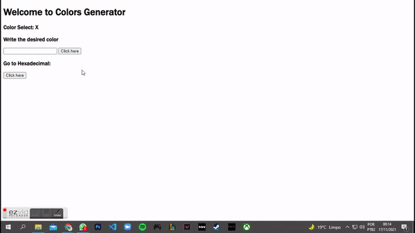

# Colors-Generator

# Descrição
Este projeto consiste em uma página que muda de cor quando o usuário clica no botão gerando uma cor randômica, ou com o usuário digitando uma cor desejada e indo para a mesma.

  

